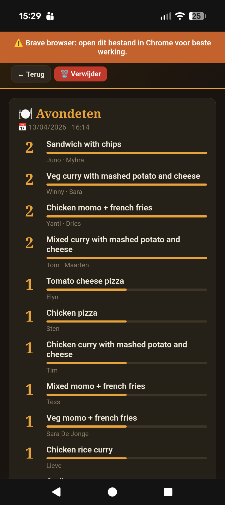
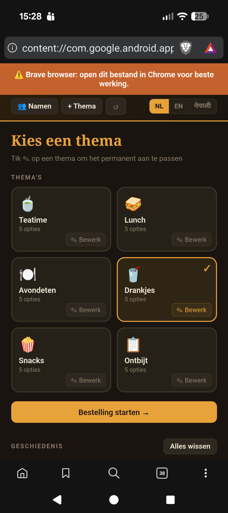

<a className="button button--primary button--lg" href="https://github.com/timdams/FoodsUp" target="_blank" rel="noopener noreferrer">✅ Open website (github.com/timdams/FoodsUp)</a>

:::info Beta
Deze tool zit nog in beta.
:::

Collect group orders in seconds — no internet required.

FoodsUp is een single-file offline HTML-app gebouwd voor groepsuitjes. Elke ronde tikt iedereen zijn naam in, kiest zijn bestelling, en de app telt de totalen meteen op.

