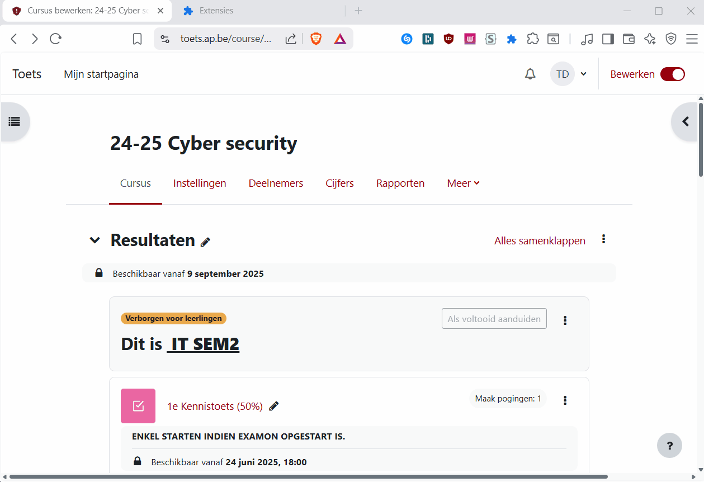

:::caution In ontwikkeling
Deze tool zit nog in alfa. Werk in uitvoering — feedback is welkom!
:::

Chrome-extensie die je helpt om een toets.ap.be-test automatisch klaar te zetten. De extensie leidt je als een soort wizard door de stappen om een toets klaar te zetten. Ze vult ook een aantal zaken automatisch voor je in, zoals de titel en de beschrijving van de toets.

