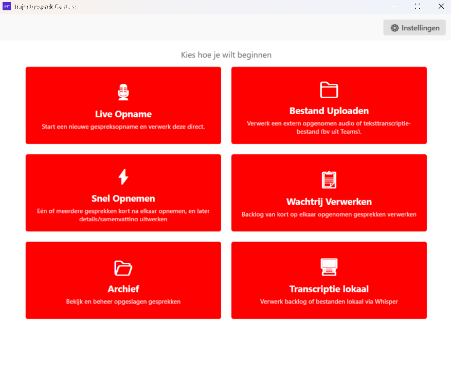
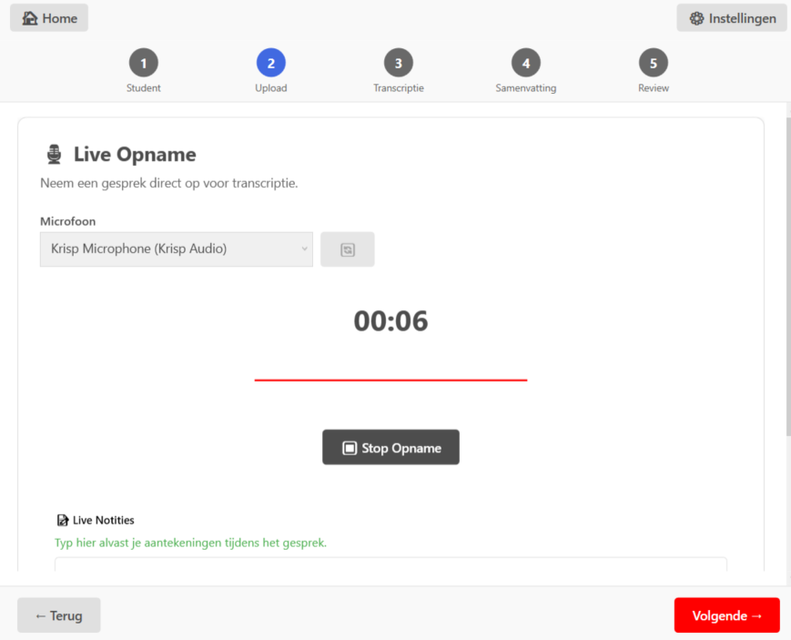
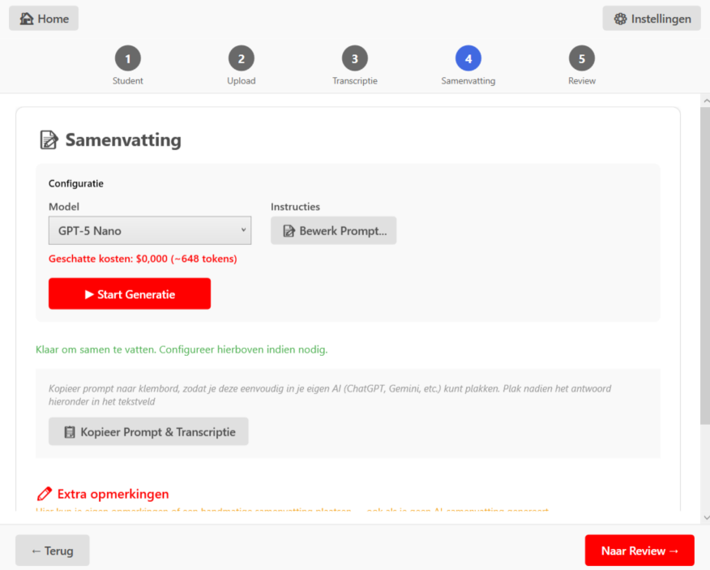

:::caution In ontwikkeling
Deze tool zit nog in alfa. Werk in uitvoering — feedback is welkom!
:::

Een Windows-desktopapplicatie om trajectgesprekken automatisch te verwerken:

- Audio-opnames uploaden of **live opnemen** via microfoon, inclusief in bulk (bv. tijdens PDT-dagen)
- Tekstbestanden (VTT, TXT, MD, DOCX) direct importeren zonder transcriptie
- Automatische transcriptie via **OpenAI Whisper API** (vast model: `whisper-1`)
- Automatische samenvatting (OpenAI Chat API, model instelbaar)
- Review en edit door gebruiker (per sectie)
- Opslag als Markdown-bestand met metadata
- Optioneel audio opslaan als MP3
- Mailtekst klaarzetten (kopieer naar clipboard, manueel plakken in mailclient)

De applicatie is ontworpen als **workflow-accelerator voor trajectbegeleiders** (single-user).

