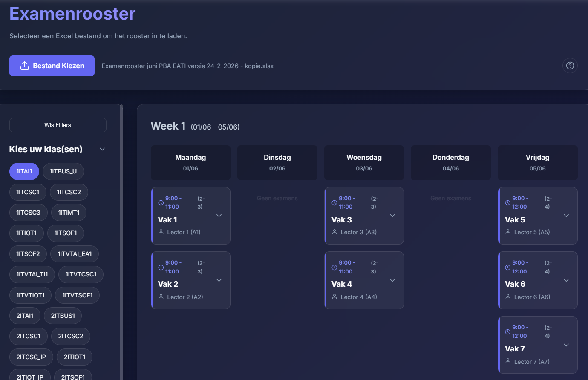

<a className="button button--primary button--lg" href="https://timdams.github.io/PreRoosterVis/" target="_blank" rel="noopener noreferrer">✅ Open website</a>

Een handige webapplicatie om  voorstelrooster Excel-bestanden visueel weer te geven. Na het inladen van de Excel kun je eenvoudig filteren op specifieke klassen, collega's of lokalen om meteen een duidelijk overzicht te krijgen.

