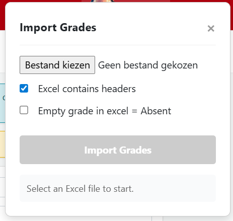

<a className="button button--primary button--lg" href="https://github.com/timdams/ibamaflexPuntenImporter" target="_blank" rel="noopener noreferrer">⬇️ Download / Open project</a>

Een handige tool en browserextensie om puntenlijsten vanuit een Excel-bestand automatisch in te laden en te matchen in iBaMaFlex. Dit bespaart veel tijd bij het overzetten van resultaten.

