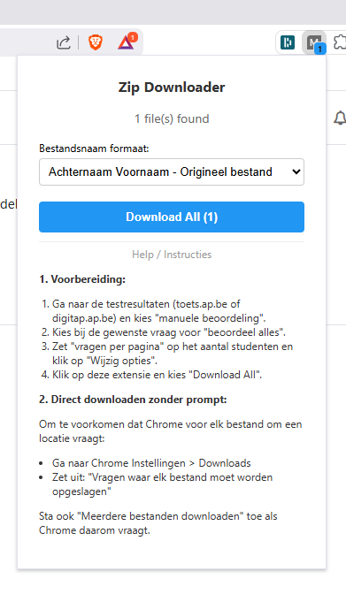

<a className="button button--primary button--lg" href="https://github.com/timdams/MassTestBijlageDownloader" target="_blank" rel="noopener noreferrer">⬇️ Download / Open project</a>

Deze Chrome-extensie helpt docenten om snel alle ingediende bestanden (zip, pdf, docx, ...) van een toets of opdracht te downloaden van toets.ap.be en digitap.ap.be. De bestanden worden bovendien automatisch hernoemd naar het handige formaat `Achternaam Voornaam_Bestandsnaam.ext`.

Voorts heeft het een module om snel een nieuwe groep aan te maken in Toets.AP op basis van een lijst (bv. van inda's). Je hoeft enkel de lijst te plakken en de groepnaam in te vullen, en de extensie doet de rest.

