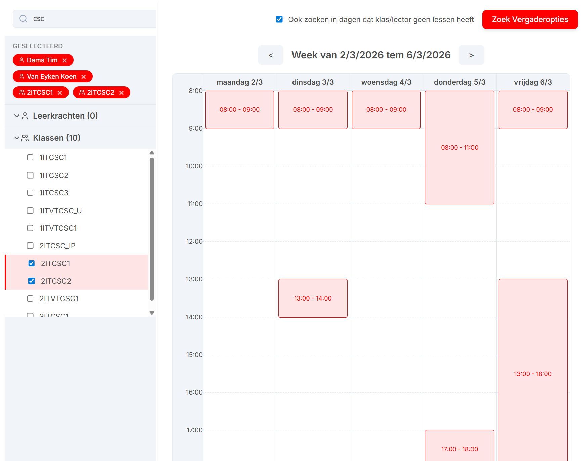

<a className="button button--primary button--lg" href="https://timdams.github.io/UntisMeetingPlanner/" target="_blank" rel="noopener noreferrer">✅ Open website</a>

Deze applicatie is ontworpen om eenvoudig een vrij meetingmoment te zoeken in de rooster van 1 of meerdere collega's en klasgroepen. De typische usecase hiervan is studentenparticipatie-vergaderingen inplannen waarbij 1 of meerdere lectoren en klasgroepen allemaal beschikbaar moeten zijn.

:::caution Opgelet
Deze tool houdt geen rekening met de agenda/kalender van de betrokken collega, en gaat volledig af op de rooster op Untis.
:::

