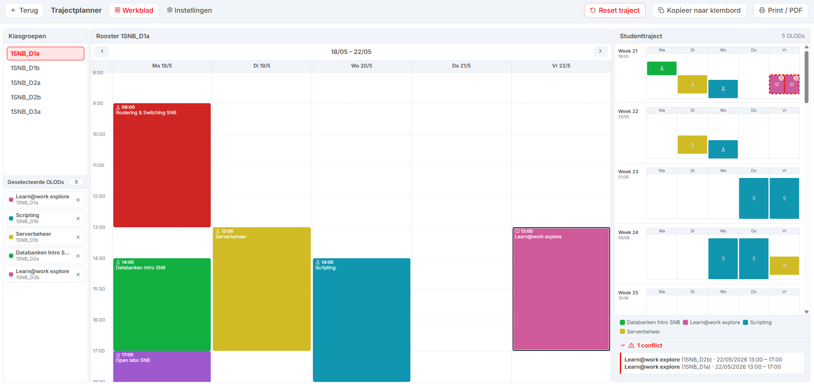

<a className="button button--primary button--lg" href="https://timdams.github.io/UntisMeetingPlanner/" target="_blank" rel="noopener noreferrer">✅ Open project</a>

Een tool die de trajectbegeleider helpt om, samen met de student, per OLOD de beste groep te kiezen en zo een conflictvrij rooster op te stellen tijdens de PDT-dagen.

## Voorbeeld

